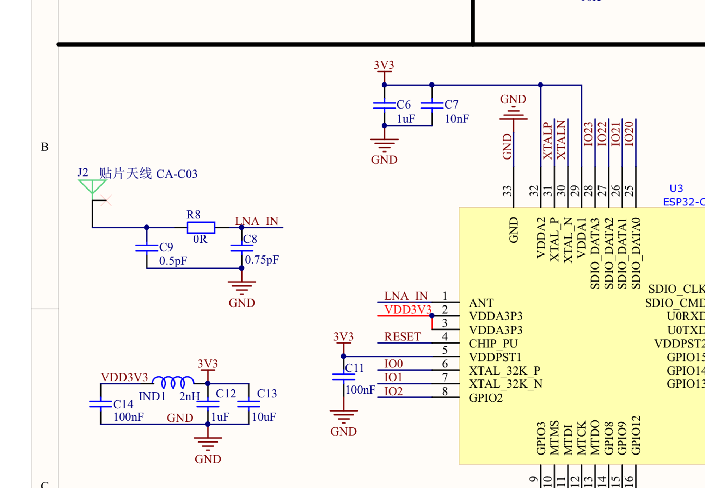
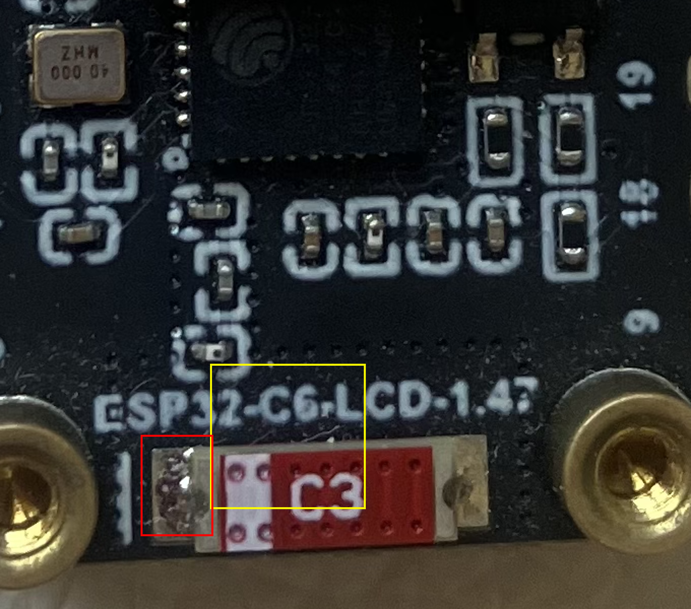

# ESP32-C6-LCD-1.47 板级自检记录

本文档记录对 **ESP32-C6-LCD-1.47**(Waveshare)在本项目工具链(ESP-IDF v6.1)下的板级功能自检方法与结果,重点分析 **WiFi 射频异常** 的定位过程,并给出判断天线/匹配元件是否**虚焊**的可操作步骤。

- 自检日期:2026-09-22
- 硬件:ESP32-C6-LCD-1.47(ESP32-C6FH4,板载陶瓷天线)
- 固件:ESP-IDF **v6.1**,目标 `esp32c6`
- 主机:macOS 13.7.8 (Intel x86_64)

---

## 1. 自检结论(先看这里)

| 功能 | 结果 | 说明 |
|------|------|------|
| 芯片 / Flash / 启动 | ✅ 正常 | esptool 读写、C/Rust/Swift 固件均能编译、烧录、运行 |
| GPIO | ✅ 正常 | Rust 示例 LED 翻转、C 示例运行 |
| **LCD(ST7789, 172×320, SPI)** | ✅ **正常** | 驱动初始化成功,屏上实测红→绿→蓝→白轮换 |
| **microSD(SPI, 与 LCD 共总线)** | ✅ **正常** | 格式化 FAT 后:挂载、写文件、写 1MB 大文件、读回、重复重挂载持久化全部通过 |
| **WiFi(2.4GHz)** | ❌ **异常(硬件)** | 天线在位但 RF 衰减约 **60 dB**,无法关联/发射;已排除软件/校准因素 |

> **结论:除 WiFi 射频外,板子其余已验证功能全部正常。** 建议按第 4 节定位并修复 WiFi 硬件问题。

---

## 2. 环境与版本

| 组件 | 版本 |
|------|------|
| ESP-IDF(子模块) | v6.1 |
| Python(ESP-IDF venv) | 3.13 |
| CMake / Ninja | 4.4.3 / 1.13.2 |
| Rust(host / target) | 1.98.1 / nightly 1.100 + build-std |
| Swift | 6.5-dev(main-snapshot) |
| 串口 | `/dev/cu.usbmodem14101`(内置 USB-Serial-JTAG) |

---

## 3. 自检项目与方法

### 3.1 芯片 / Flash / 启动
- `esptool ... flash_id` 读取 MAC/flash 正常。
- 校验 flash 各偏移:bootloader `0x0`、分区表 `0x8000`、app `0x10000` 头部均为合法 `0xE9`。

### 3.2 GPIO
- 仓库 Rust 示例(`project/rust`)GPIO 翻转 + 日志正常。

### 3.3 LCD(ST7789 172×320, SPI)
- 引脚:**MOSI=GPIO6, SCLK=GPIO7, CS=GPIO14, DC=GPIO15, RST=GPIO21, BL=GPIO22**。
- 使用 ESP-IDF 组件 `esp_lcd`(`esp_lcd_new_panel_st7789`),`set_gap(34, 0)`。
- 结果:初始化成功,屏幕按 红→绿→蓝→白 轮换(肉眼确认)。

### 3.4 microSD(SPI)
- 引脚:**CS=GPIO4, MISO=GPIO5, MOSI=GPIO6, SCLK=GPIO7**(与 LCD 共用 MOSI/SCLK,CS 独立)。
- 首次挂载失败:`FR_NO_FILESYSTEM(13)`。dump 扇区0 发现该卡是 **x86 MBR + 一个 Linux(0x83)分区**,并非 FAT 文件系统 —— 即卡里是某 Linux 镜像,**不是板子问题**。
- 重新插卡到底(接触)后,卡片初始化在 400kHz/4MHz/10MHz/20MHz **全部成功**(`SA08G` / SDHC / 7386MB)。
- 格式化为 FAT 后:`mount=ESP_OK`;写 `orz_test.txt` 读回 `OrzEmbed SD OK`;写 1MB `orz_big.bin` 并 `stat=1048576`;重复卸载/重挂载均成功 → **SD 读写正常**。

### 3.5 WiFi(异常,详见第 4 节)

---

## 4. WiFi 问题定位

### 4.1 量化证据(同一 AP、同一位置)

| 观察项 | 参考(Mac,同处) | ESP32-C6 | 差异 |
|--------|------------------|----------|------|
| 接收同一 AP `JokerHub`(ch6) | **-35 dBm** | **-91 ~ -97 dBm** | **约 55~60 dB** |
| 附近 AP 数量 | 10 | 0~1 | — |
| ESP32 SoftAP(`OrzEmbed-Test`) | Mac 扫不到/连不上 | — | TX 不可达 |
| STA 关联 | — | `reason=201`(NO_AP_FOUND)、认证超时 `reason=2` | 拿不到 IP |

### 4.2 已排除的软件/配置因素

- **软件栈正常**:驱动初始化、扫描、SoftAP、关联状态机、AP 能力解析均能执行,无软件报错/崩溃(ESP-IDF v6.1 未破坏 WiFi 功能)。
- **TX 功率正常**:`CONFIG_ESP_PHY_MAX_WIFI_TX_POWER=20`,`esp_wifi_get_max_tx_power()=80`(=20 dBm)。
- **国家码/信道正常**:`country=01`,信道 1–11,ch6 合法。
- **非校准/NVS 损坏**:整片擦除 flash + 强制全量 RF 校准后,仍为 ~-97 dBm。
- **非测试方法问题**:被动扫描(每信道驻留 1s)同样只收到 -91 dBm。

### 4.3 硬件现状(原理图 + 实物图)

- 天线为**板载陶瓷天线**(官方 DESC 图标注 4,板上红色 `C3` 元件)经匹配网络 **R8(0Ω)/C8(0.75pF)/C9(0.5pF)** 直连芯片 `ANT/LNA_IN`。
- **无 RF 开关、无天线选择 GPIO、无 IPEX/U.FL 外置接口** → 软件无法切换/改善天线。
- 因此 **55~60 dB 的衰减只能来自 RF 通路的硬件问题**(典型:天线或匹配元件虚焊、陶瓷天线开裂、走线/芯片 ANT 口受损)。

---

## 5. 如何判断 WiFi 是否为“元件虚焊”

> 目标:判断 ~60dB 衰减是否由**天线/匹配元件(C3/R8/C8/C9)或芯片 ANT 引脚的虚焊/开路**引起。按 A→E 顺序最省事、最有效。

### 5.1 元件在板上的位置(关键)





- **天线 = 红色 `C3`**(板底边、两安装孔之间)。
- **匹配网络 `C9 / R8 / C8`** 是**紧挨天线馈点的一簇小元件**:
  - `C9`(0.5pF,并联到地)——最靠近天线馈点;
  - `R8`(0Ω,串联)——在 C9 与 C8 之间;
  - `C8`(0.75pF,并联到地)——在接往芯片 `ANT` 的节点上。
  - 均为 0201/0402 元件;`R8` 常为黑色 0Ω(可能印 `000`),`C8/C9` 为无标陶瓷电容。
- **芯片 `ANT` 脚 = U3 的 pin 1**,即经该网络连到天线的那个引脚。
- 标注图中:**黄框 = 天线 C3;红框 = C3 左侧紧邻的小元件**。实测照片显示该元件**左焊盘是一大团不规则焊锡**,与旁边正常焊点明显不同 → **优先怀疑冷焊/虚焊,先补焊它与 C3**。

**用万用表确认 `C9/R8/C8` 与 `ANT` 脚(务必断电,用通断档):**
1. 找到 `C3` 的**馈电焊盘**(非接地的那一端);
2. 沿铜箔/走线量:第一个**并联到 GND** 的元件 = `C9`;
3. 再往前一个**串联、两端 ≈ 0Ω** 的元件 = `R8`;
4. 再往前一个**并联到 GND** 的元件 = `C8`;
5. `C8` 所在节点继续往芯片走,连到的就是 **U3 pin1(ANT)**。

### A. 目视检查(放大镜/显微镜 10× 以上)
- 陶瓷天线(`C3`)与 `R8/C8/C9`**两端的焊点**:是否有焊锡不足、发暗、拉尖、裂纹、立碑(tombstone)、偏移。
- 芯片 `ANT` 引脚及到匹配网络的**走线**:是否有断线、虚焊、锡珠。
- **陶瓷天线本体**是否有**裂纹/崩角**(陶瓷很脆,裂纹会直接导致失谐或断路)。

### B. 万用表通断/电阻(务必断电)
- **0Ω 电阻 `R8` 两端应导通(≈0Ω)**,开路即为虚焊/损坏。
- 查**直流通路**(天线馈点 → 匹配 → 芯片 ANT)是否导通;注意串联电容会隔直,需对照原理图判断哪些点本应直通。
- 测焊点接触电阻,正常应 < 几 Ω;明显偏大或时通时断 = 虚焊。
- ⚠️ 万用表**只能查通断,不能评估 RF 性能**。

### C. 补焊/reflow 验证法(最实用,一步“判定+修复”)
1. 在天线、`R8/C8/C9` 及芯片 `ANT` 附近涂助焊剂;
2. 热风枪 **250~280℃、低风速**,对上述元件重新回流 **5~10 秒**;
3. 冷却后**立即复测 RSSI**(用第 6 节方法);
4. 若 RSSI 从 ~-90 改善到 **-40~-60dBm**(能关联)→ **确认是虚焊**。

### D. 搭线/替换天线对比法
- 在**天线馈点**临时焊一根 **~3cm 导线**(或接一个外置 2.4GHz 天线);
- 若 RSSI **大幅改善** → 板上天线/匹配网络**开路或失谐**;
- 若仍很差 → 问题更靠上游(芯片 `ANT` 口/内部),或换一块天线试。

### E. 换件/换板对比
- 直接**更换同规格陶瓷天线**(CA-C03 或等效 2.4GHz 芯片天线)后复测;
- 换一块**同型号正常板**:正常板 WiFi 正常 → 本板为个例次品(走退换)。

### F. VNA / S11(有仪器时,可选)
- 用 NanoVNA + 探针/夹具测天线端口回波损耗;**2.4GHz 处 S11 应 < -10dB**;
- 若 S11 接近 0dB(几乎全反射)→ 天线**未连通/开路**,佐证虚焊或天线损坏。

### 判定对照表

| 复测现象 | 推断 |
|----------|------|
| 补焊后 RSSI 明显改善 | **虚焊**(最常见) |
| 搭线/接外置天线后大幅改善 | 板上天线/匹配断路或失谐 |
| 补焊 + 换天线后仍差 | 芯片 `ANT` 口受损等更严重硬件问题 |
| 换同型号板正常 | 本板次品 |

---

## 6. 复测方法(固件侧,量化对比)

复测时保持**板子位置/朝向一致**,用下面的最小固件记录 RSSI,便于对比修复前后:

```c
// 被动扫描,每信道驻留 1s,打印每个 AP 的 RSSI
wifi_scan_config_t sc = { .show_hidden = true, .scan_type = WIFI_SCAN_TYPE_PASSIVE };
sc.scan_time.passive = 1000;
esp_wifi_scan_start(&sc, true);
uint16_t n = 0; esp_wifi_scan_get_ap_num(&n);
uint16_t max = n ? n : 1;
wifi_ap_record_t *r = calloc(max, sizeof(*r));
esp_wifi_scan_get_ap_records(&max, r);
for (int i = 0; i < max; i++)
    ESP_LOGI("scan", "ssid='%s' rssi=%d ch=%d", (char*)r[i].ssid, r[i].rssi, r[i].primary);
```

参考判定:同一 AP 若 ESP32 的 RSSI 比同处手机/电脑低 **>20dB**,或强 AP(< -50dBm)都收不到,即视为 RF 异常。

---

## 7. 引脚定义速查

| 功能 | 引脚 |
|------|------|
| LCD MOSI / SD MOSI | GPIO6 |
| LCD SCLK / SD SCLK | GPIO7 |
| SD MISO | GPIO5 |
| SD CS | GPIO4 |
| LCD CS / DC / RST / BL | GPIO14 / GPIO15 / GPIO21 / GPIO22 |
| RGB LED | GPIO8 |
| BOOT | GPIO9 |

> 注意:刷写后内置 USB-Serial-JTAG 可能停在 DOWNLOAD 模式,串口无输出属正常,按 **RST** 或重新插拔 USB 即可运行。
